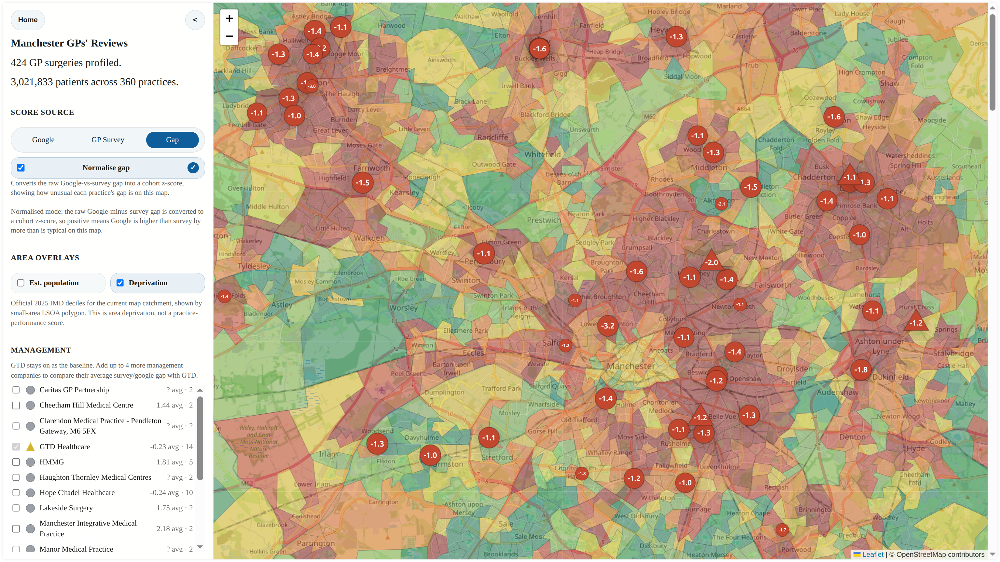
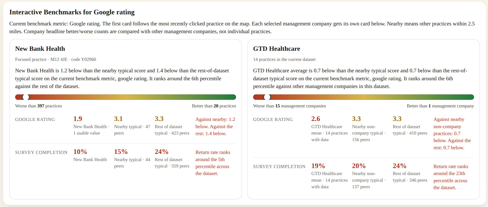
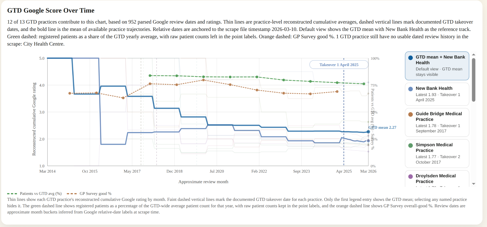
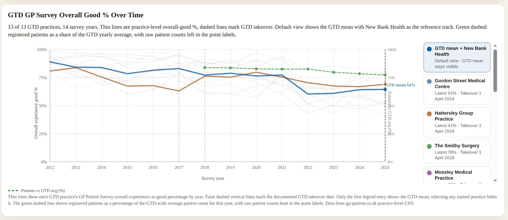

# Digital Access Failures - New Bank Health Centre (NHS GP Practice, Manchester)

This repo documents ongoing concerns about **patient access, digital systems, and front‑door process** at New Bank Health Centre (run by GTD Healthcare).

For the quickest public overview, start with [the homepage](<https://bobdavies.co.uk/nhs-complaint-dec-2024/>) or the [interactive map of google reviews for Manchester GPs](https://bobdavies.co.uk/nhs-complaint-dec-2024/map/map.html) or the [reviews summaries/browser](https://bobdavies.co.uk/nhs-complaint-dec-2024/reviews-evidence/) for analysis and details.

It contains only publicly available data so that the evidence and reasoning are transparent to patients, staff, GTD, and anyone else trying to improve access. These issues pre-date GTD's control of New Bank, but have continued since their take-over in April 2025, with only very minor improvements.

  - Patients are being excluded by the practice requiring a mandatory unscheduled office-hours phone call, forcing them to start over
  - Patients are being treated as if they are to blame, wherever the practice's flawed 'efficiency' decisions are excluding them in ways that are hard to measure the impact
  - Some patients are being excluded completely by 'digital-only' process start, poor workflow choices and reception stiffness

## What’s in this repository?

- **Complaint details and meeting prep**
  - [ORIGINAL_COMPLAINT.md](./ORIGINAL_COMPLAINT.md) - initial long‑form complaint about the appointment system. Dec 2024, updated Aug 2025.
  - [OBJECTIVES.md](./OBJECTIVES.md) - Shorter form summary of issues.
  - [meetings-notes/](./meetings-notes/) - Documentation for each meeting, and my prep/issues and received handouts with my notes.
  - [meeting4-goals.md](./meetings-notes/2026-01-04-meeting4/meeting4-goals.md) - Meeting 4 (Feb 2026) prep
  - [My Patient Experience at New Bank](./My-new-bank-experience.md)
- **Data and analysis**
  - `patient-survey-breakdown/` - breakdown of GP Patient Survey results for New Bank and further research.
  - `reviews/` - Google review HTML/text, parsing scripts, and parsed outputs.
  - `messages/` - Log of sent messages (mostly emails, complaint-related only).
  - `healthwatch-reports/` - Healthwatch reports from around the UK sharing these concerns.
  - `ppg-terms-review/` - What is a PPG for? and how can it do that effectively? 
- [My own experience](./My-new-bank-experience.md) trying (and failing) to see my doctor, as a patient who works nights.
- [Notes](#Notes) - My notes that don't fit anywhere else.
- [Ongoing/further Research](#ongoingfurther-research) - What's next.
  - [Reviewing the updated draft PPG terms docs](./PPG-terms-review/PPG-terms-review.md)
  - [Exclusion questions - Is exclusion a problem here?](./Exclusion-questions.md)
- **Produced reports/evidence packs**
  - [Manchester GP reviews map - Google rating vs Patient Survey](./google-vs-patient-survey/GTD%20Greater%20Manchester%20GP%20Practice%20Experience%20-%20Google%20vs%20Patient%20Survey%20Gap.pdf)
  - [General GP practice stats and scope/environment notes](./meetings-notes/2025-09-10-meeting2/benchmarks-summary-sept-10.md)
  - [PATCHS trustpilot reviews for lots of useful patient input](./reviews/PATCHS/output%20reports/PATCHS%201-2-3%20Star%20Reviews%20with%20Summary%20Panel%20Landscape.pdf)
  - [Patient blaming evidence pack](./meetings-notes/2026-01-04-meeting4/PatientBlaming-README.md)
  - [Affected patients estimates and Healthwatch overview](./meetings-notes/2026-01-04-meeting4/GP%20Access%20Evidence%20-%20Websites%20triage%20and%20digital%20barriers.md)
  - [Poor NHS access and political extremism](./meetings-notes/2026-01-04-meeting4/GP%20Access%20Evidence%20-%20Immigration%20blame%20and%20far-right.md)
  - [Google reviews management and good response patterns](./meetings-notes/2026-01-04-meeting4/reviews-management.md)

The focus throughout is **patient access**, not clinical care quality.

## Main concerns

1. **Web-only booking**
  - Access is **digital‑only**
    - No simple “walk in and make an appointment” route
    - Told "You have to go online" every time in reception
  - Excludes patients with:
    - No stable internet/devices, old devices (3yr+ phones/tablets, netbooks)
    - Poor or non-technical, hesistancy/confusion with forms
    - No daytime availability
    - Adds friction even for confident users
  - NEED Access route that doesn't rely on the website

1.5. **Apparent lack of understanding about patient complaints**
  - 'Newsletter' issued via sms on March 9th 2026 still very insistent about forced through online:
    - `You are welcome to complete the online request form yourself. If you would rather phone us or visit the practice, a member of our reception team will complete the form on your behalf.`
    - Newsletter contains no news, and isn't a letter, it's basically just a "use the website" help sheet, with lots of complicated and repetitive instructions.
    - Sent the sms with the  wrong link?
      - Couldn't contact the practice online to ask, because the 'contact the practice' displays "form unavailable".
  - How many patients need to complain about the poor quality website/workflow and bad responses from staff before you stop sending them annotated screenshots like they're simply stupid?
    - The website sucks so bad, patients are right to not want to deal with it.
    - My local practice had a better online experience in the late nineties. Why do you think this barely functional mess is acceptable in the modern world?

4. **Can't start appointment process outside office hours**
  - Partially progress, admin requests are now open out of hours (since 14th Jan)
  - but... Appointments cannot be requested.
    - This is only enabled when the office is open
      - Doctor claims it avoids missing urgent/emergency contacts. Evidence?
      - [The doctors’ union claims ministers have broken a promise made then to implement “necessary safeguards” before 1 October to ensure that patients only sought non-urgent consultations online.](https://www.theguardian.com/society/2025/sep/29/gps-doctors-england-online-appointment-booking-plan-strike-action-threat)
        - Must find evidence for these claims
        - Supposed "barrage of online requests and queries" are patients asking for help, not abstract database entries
          - If they can't get through, they don't exist, right?
      - If it's about workload, what else can we change to avoid impacting exclusion?
      - Should be possible to start appointment requests out of hours

2. **Unscheduled missed calls cause deletion/resubmission loop**
  - If the doctor calls for triage OR the receptionist calls to arrange an appointment, and the patient misses two **unscheduled** calls, with no route to schedule or bypass the call, the **request is closed** and the patient must start over.
    - PPG agreed SMS support will be added as fallback instead of deletion (expected by end of Feb 2026)
    - This _should_ somewhat mitigate the problem, but could be improved upon with a bookable slot picker (PATCHS supports this)
  - Current system excludes patients who work nights/shifts and [other groups](./meetings-notes/2026-01-04-meeting4/GP%20Access%20Evidence%20-%20Websites%20triage%20and%20digital%20barriers.md)

3. **Reception**
  - Reviews describe **rude, dismissive, or blocking behaviour** at reception, especially with distressed/complex patients.
    - Some severe recent reviews, but general tone seems to be improving as reception restaffed. Monitor. 

5. **Metrics vs reality**
  - Please investigate lost/excluded patients
  - No active complaints procedure beyond PPG
    - [Contact the practice](https://newbank.nhs.uk/form/contact-the-practice/) shows `Form Unavailable`

6. **Loss of continuity: Diagnostic delay**
  - When tests come back all green, no follow-up with the patient
  - Compounded by 'hard to start' and 'easy to fail' workflow
    - How to improve focus from 'tasks' to patients' real issues?

7. **Slow change rate from PPG**
  - Took a year to fix a simple problem
    - Well documented, but not well communicated
    - PATCHs intro delayed addressing phone-blocker
    - Staff shortage deprioritised change
    - Long waits between meetings prevented nagging
  - What is the pattern for actioning change in future?
    - What is (and who has) the evidence burden?
    
---

### Commentary on Main Issues

Logged [My Patient Experience at New Bank](./My-new-bank-experience.md)

Out-of-hours access and mandatory phone steps

- The workflow assumes "**a doctor MUST be present and online at the moment someone requests an appointment**".
- Appointment requests remain unavailable outside office hours
  - The office-hours phone step is still (currently) mandatory to progress.
- A key benefit of online systems is **decoupling clinician availability from request submission**, with appropriate urgent-care safeguards.
- Clarify who owns these workflow decisions and what constraints apply (clinical risk, staffing/backlog management, contractual/legislative requirements).
- Consider measuring overnight demand during a time-limited trial to quantify impact and identify excluded patients.

Survey metrics may understate access barriers

- The current patient survey status shows 22% of patients report it being hard to get an appointment.
- This is an improvement on last year's 39%, though this isn't directly comparable:
  - the 39% is the inverse of people who found it easy to contact the practice by phone
  - it also excludes the "I haven't tried" contingent
- The real number may be higher if the survey wording (unintentionally) allows some access issues to fall between available answers.

Diagnostic delay / premature closure, compounded by access

- On the diagnostic issue, I don't think it reaches clinical negligence (it hasn't resulted in the worsening of my condition).
- Premature diagnostic closure or diagnostic delay (made more severe by poor access) seems a more appropriate label.
- At least one other PPG patient mentioning this suggests it may not be uncommon to close conditions without full investigation or identification of causes.
- Operationally, repeated request closure/deletion can force patients to restart, compounding delay.

### Ongoing/further research

Request deletion and forced “start over” workflows [PENDING IMPLEMENTATION]

- Staff have claimed "everyone does this" regarding making patients 'start over' (deleting requests for missed calls, or multiple daily submissions/second after deletion on same day). How many practices have systems that delete patient requests?
- PATCHS reviews suggest that it does not solve this.
- Confirmed myself, 2 missed calls results in no further action, ticket is closed, cannot be reopened.

Review patterns and “everyone has bad reviews”

- Staff have claimed 'of course reviews are bad' (as if ALL reviews are bad, because 'nobody writes good reviews') in the PPG.
- Many local practices have bad reviews for similar reasons, but others have strong reviews (including 1 under GTD).
- If the pattern holds in some places, how common is it, and what are the common drivers?
- Research suggests more bad reviews than good is normal, but don't have data for a sensible range, yet

Unclear request types (clinical vs admin; urgency)

- The language around request types is confusing.
- Many patients don't know if what they need to see a doctor about falls under clinical or admin, or what is a non-pressing issue or what's urgent.
  - If I have some pain, or a meds question, is that clinical? Who knows? Where to find out?
  - There's several layers of website, and none of them seem to say the same thing. These are presumably different layers of NHS/practice infrastructure?
  - Maybe better visibility of the organisational model would be useful on the site. It's not clear who is responsible for what.
- The categories seem to be emergency (call 999), urgent (a doctor will try and get you in asap) or normal (usually within 3 days)

PPG terms review, patient burden, and complaint routes

- PPG Terms & rules, patient burden and what is the objective of the the PPG?
- GTD are updating the documentation that patients must agree to operate within, mostly as a personal and legal safety valve
  - Shares a lot of features with other PPG membership documents from practices around the UK
  - How effective/performative are PPGs?
- What is the recourse for a patient who wants to complain, but doesn't agree to every single term in the documentation? Like what if the 'unknown' (what am I agreeing to keep confidential? what if I don't want to be on a database? what if I don't want to, or can't sit in a meeting with strangers on an irregular schedule?)
  - Are there still functional feedback/complaint mechanisms? What are they?
  - PPG results are SLOW (6 months and still no change on even very small issues), for small or transient PPGs, continuity over time is going to be hard as patients become discouraged by no change, or at least by no immediate change.
  - Without an organising platform or more regular contact, how are patients expected to co-ordinate individual concerns and identify shared problems?
- The documents being available for review is good, but most patients are not well versed in legal speech or procedural jargon, especially where language barriers exist, might be better supported with much less legalese, and instead sticking to a one-page (or maybe 2) that keeps a group casual.
- See [Reviewing PPG terms docs](./PPG-terms-review/PPG-terms-review.md)

GP Patient Survey: question design and why is New Bank's reply rate barely 10%?

- Further work to do on the GP Patient Survey
- The patient survey (national, written by a couple of major universities) has some pretty obvious oversights, that _might_ be unintentionally hiding the scale of some access problems, and subtly patient-blame
  - Framing a lack of options as preferences, and framing systemic failure as personal decisions
  - The young/comfortable students writing/setting the questions in Cambridge and Exeter unis may not have the same access issues/limitations as many other patients.
- I have the full patient survey questions for follow-up
- Very low ~10% reply rate on New Bank's Patient Survey, way below national average of ~25%.
  - Why so few replies to the survey? Have people lost hope the practice can improve?

Benchmarking vs nearby practices (GTD and non-GTD)

- Comparing to local/regional practices
  - Next step: compare New Bank and **other GTD sites** to **nearby non‑GTD practices**, and practices of similar sizes/catchments.
  - Early observation: most GTD‑run practices in Manchester cluster around **~2★** overall on Google, with very similar complaint patterns: rudeness/mistreatment, access issues, procedural failings, and a lack of understanding/help from staff.
  - [PDF printoff: GTD Greater Manchester GP Practice Experience (Google vs Patient Survey)](./google-vs-patient-survey/GTD%20Greater%20Manchester%20GP%20Practice%20Experience%20-%20Google%20vs%20Patient%20Survey%20Gap.pdf)
  - How common **complex access / phone‑blocking / web‑off** models are.
  - Quantify how many GTD practices, and how many local/regional/national practices, **switch their websites/online forms off** outside office hours.
    - May be able to gather this automatically via a simple monitoring script that pulls practice websites from NHS listings.

This maps the practices where there is a large difference between google reviews and patient survey's overall good%, i.e. where the patient survey doesn't represent the real experiences of patients, over deprivation. GTD practices are triangles.

See also: [Manchester GPs reviews map](https://bobdavies.co.uk/nhs-complaint-dec-2024/map/map.html)

Effective use of resources?

  
- [@gtdhealthcare on twitter/x](https://x.com/gtdhealthcare/with_replies) posts every day, sometimes twice, pretty good quality content, but has had 3 likes, 1 retweet on only 2 tweets, and zero replies, in 6 months (as far back as I scrolled before ads for crypto scams and far-right content appeared).
  - Views rarely top 50 (and almost all of those will be firehose bots, check for an immediate view spike on posting, then no growth after more than a few minutes), despite 953 'followers' there is almost-zero engagement (a follower poll showed mostly several-year dead accounts or obvious scammers, only a few 'real' people accounts).
  - Unless that daily content cycle is completely free and automated, maybe those resources would be better spent somewhere useful in the org.

### Escalation routes beyond GTD

- Map escalation routes beyond GTD (ICB, NHS England, CQC, ombudsman) specifically for **access and digital exclusion** rather than individual clinical events.
- Escalation is outlined in [ESCALATION.md](./ESCALATION.md).
  - Will be revised before action, but that's the general idea.

The aim is not to “name and shame” a single surgery/company, but to show where **process and tools are systematically failing patients**, especially at New Bank and GTD. Many [Healthwatch groups are tracking these same issues](./meetings-notes/2025-11-26-meeting4/send-to-gtd-team-pre-nov26/GP%20Access%20Issues%20-%20Evidence%20Pack%20-%2026%20Nov%202025%20Bob%20Davies.pdf) all over the country, this is one part of that, and will escalate to Healthwatch Manchester as needed, to encourage them to join the other groups in trying to get these problems fixed everywhere.

### TODOs

- Current task is making this document digestible as an overview.
- Deprivation study connects to https://www.nuffieldtrust.org.uk/resource/fairer-funding-for-general-practice-in-england